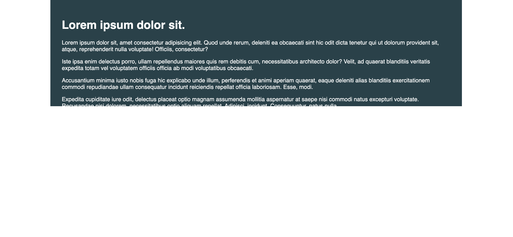
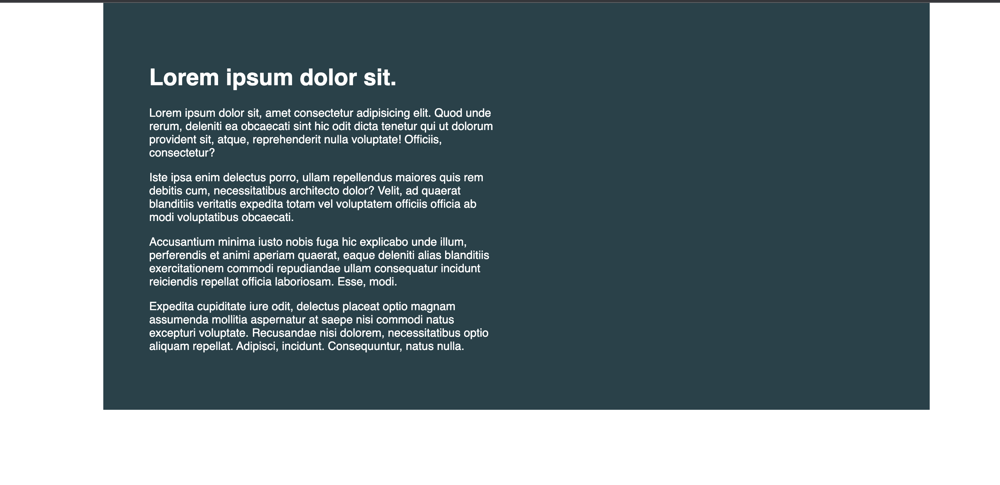

##Day one
  Day one of conquering responsive layouts
  
## Table of contents

- [Overview](#overview)
  - [The challenge](#the-challenge)
  - [Screenshot](#screenshot)
  - [What I learned](#what-i-learned)
- [Author](#author)

## Overview

### The challenge

Users should be able to:

- control overflow of content 

### Screenshot

### What I learned

I learned how and when to use different em and rem. I also learned that padding is a good substitute if you want to increase height of a background. 

## Author

- Frontend Mentor - [@thegirlcoderr](https://www.frontendmentor.io/profile/thegirlcoderr)
- Twitter - [@thegirlcoder](https://twitter.com/thegirlcoder)
